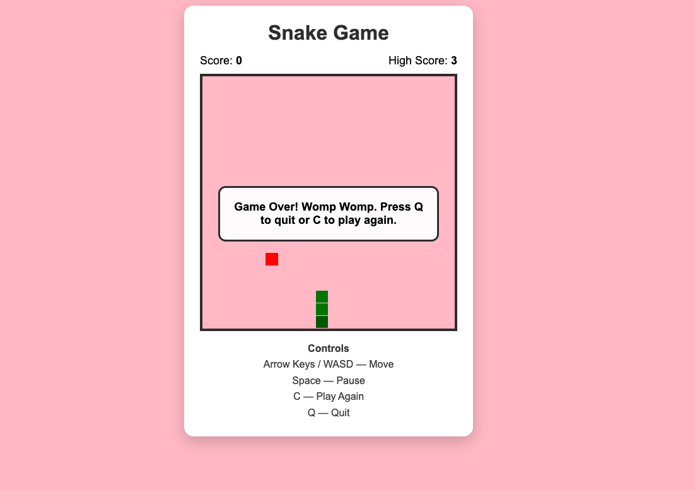
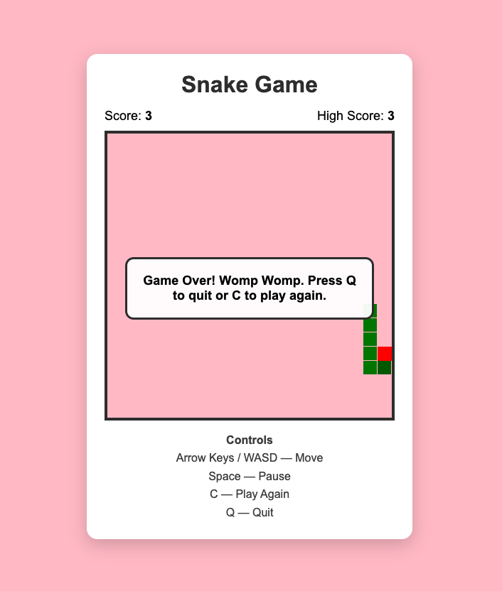

# Snake Game

A browser-based Snake game built with HTML, CSS, and JavaScript as part of the Zero To Mastery Prompt Engineering Bootcamp.

The project was developed iteratively with AI assistance, with a focus on prompt engineering, feature development, debugging, testing, and understanding the reasoning behind code changes.

## Live Demo

**[Play the Snake Game](https://helenofhealth.github.io/ztm-prompt-engineering-bootcamp/snake-game/)**

The game is deployed with GitHub Pages and runs directly in the browser.

## Demo

Open `src/index.html` in a modern web browser to run the game locally.

## Screenshot




## Features

- Classic Snake gameplay
- HTML Canvas rendering
- Keyboard controls using Arrow Keys and WASD
- Mobile touch controls
- Randomly generated food
- Snake growth
- Score tracking
- Persistent high score using `localStorage`
- Wall collision detection
- Self-collision detection
- Configurable snake speed
- Pause and resume
- Restart functionality
- Quit functionality
- Custom game-over message

### Game Controls

| Control | Action |
|---|---|
| Arrow Keys | Move the snake |
| WASD | Move the snake |
| Space | Pause / resume |
| C | Play again |
| Q | Quit |

## Technologies

- HTML5
- CSS3
- JavaScript
- HTML Canvas
- Browser `localStorage`

## Project Structure

```text
snake-game/
├── README.md
├── src/
│   ├── index.html
│   ├── style.css
│   └── game.js
├── assets/
│   └── screenshot.png
└── prompts/
    └── build-prompts.md
```

## AI-Assisted Development

This project was created through an iterative AI-assisted development process.

Rather than accepting the first generated version, I used AI to:

1. Generate the initial implementation.
2. Add and modify features.
3. Investigate bugs.
4. Review game-state logic.
5. Improve restart, pause, and quit behavior.
6. Test the resulting application.
7. Document defects and corrections.

The complete development prompts are documented in:

[`prompts/build-prompts.md`](prompts/build-prompts.md)

## Example AI-Generated Defect

One area that required debugging was game-state management.

The game has several possible states:

- Running
- Paused
- Game Over
- Exited

These states need to be handled independently because keyboard commands behave differently depending on the current state.

For example, restarting a game without correctly clearing the previous game loop could result in multiple `setInterval()` loops running simultaneously.

This can cause the snake to move unexpectedly fast or produce inconsistent game behavior.

## Correction

The final implementation explicitly tracks game state:

```javascript
let gameRunning = false;
let gamePaused = false;
let gameOver = false;
let gameExited = false;
```

The initialization function resets the state and clears any existing game loop before creating a new one:

```javascript
clearInterval(gameLoop);
gameLoop = setInterval(update, gameSpeed);
```

This ensures that restarting the game does not create multiple simultaneous game loops.

## Why the Correction Matters

The important lesson was that the problem was not simply a missing line of code.

The underlying issue was **state management**.

Separating the different game states makes the application easier to reason about and prevents controls from producing unintended behavior.

This also makes the code easier to extend with additional features later.

## What I Learned

This project gave me practical experience with:

- Prompt engineering for code generation
- AI-assisted development
- Iterative debugging
- JavaScript event handling
- Game-state management
- Collision detection
- Canvas rendering
- Browser storage
- Testing AI-generated code
- Reviewing and correcting AI-generated implementations

## Portfolio Relevance

Although this project is a game, the development process demonstrates transferable AI-development skills.

The same workflow can be applied to larger AI applications:

```text
Requirement
    ↓
Prompt
    ↓
AI-generated implementation
    ↓
Run and test
    ↓
Identify defect
    ↓
Debug
    ↓
Understand the correction
    ↓
Iterate
    ↓
Document
```

This is the development approach I am applying while building toward AI development and GoHighLevel + AI automation work.

## Status

**Completed**

The game has been tested locally and the final source code is available in this repository.
