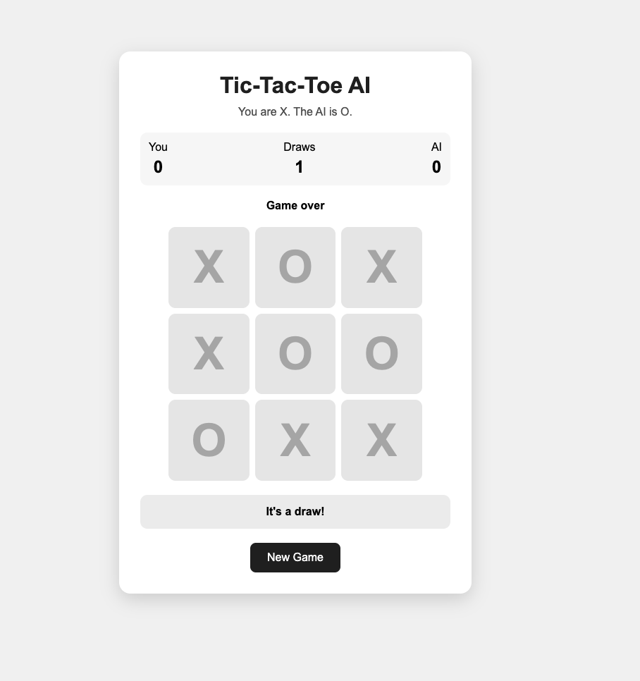

# Tic-Tac-Toe AI

An AI-powered Tic-Tac-Toe game built with HTML, CSS, and JavaScript as part of the Zero To Mastery Prompt Engineering Bootcamp.

The project demonstrates AI-assisted development, game-state management, algorithmic decision-making, testing, and debugging.

## Live Demo

**[Play Tic-Tac-Toe AI](https://helenofhealth.github.io/ztm-prompt-engineering-bootcamp/)**

The live version is deployed with GitHub Pages from the project's `src/` directory.

## Screenshot



## Features

- Human vs AI gameplay
- 3 × 3 Tic-Tac-Toe board
- Human player uses X
- AI player uses O
- Minimax AI decision-making
- Win detection
- Draw detection
- Invalid-move handling
- Game-state management
- Game reset
- Persistent score tracking during the session
- Responsive interface

## How It Works

The player makes the first move as X.

After each valid player move, the game:

1. Updates the board.
2. Checks for a winner.
3. Checks for a draw.
4. Gives the AI control if the game continues.
5. Uses Minimax to evaluate possible moves.
6. Selects the strongest available move.
7. Updates the board.
8. Checks for a winner or draw.

## AI Decision-Making

The AI uses the **Minimax algorithm**.

Minimax evaluates possible future game states rather than simply selecting a random empty square.

The decision process can be simplified as:

```text
AI considers a move
       ↓
Simulate the move
       ↓
Consider the human's best response
       ↓
Consider the AI's best response
       ↓
Continue until a terminal state
       ↓
Evaluate the outcome
       ↓
Choose the highest-scoring move
```

The evaluation system uses:

| Outcome | Score |
|---|---:|
| AI win | Positive |
| Human win | Negative |
| Draw | 0 |

The algorithm also uses recursion depth so the AI prefers faster wins and delays losses.

## Game Rules

- The board contains nine positions.
- The human player is X.
- The AI player is O.
- Players alternate turns.
- Three matching symbols in a horizontal, vertical, or diagonal line wins the game.
- A full board without a winner results in a draw.
- Players cannot select an occupied square.
- Additional moves are disabled after the game ends.
- Starting a new game clears the board while preserving the session score.

## Testing

The game was tested against several scenarios:

| Test | Result |
|---|---|
| Game loads correctly | PASS |
| Valid player move | PASS |
| Invalid move on occupied square | PASS |
| Human winning position | PASS |
| AI winning position | PASS |
| AI blocks immediate winning threat | PASS |
| Draw condition | PASS |
| New game resets board | PASS |
| Score persists after new game | PASS |
| Moves disabled after game ends | PASS |

Detailed testing and development documentation is available in:

[`prompts/build-prompts.md`](prompts/build-prompts.md)

## AI-Assisted Development

The project was developed iteratively with AI assistance.

The workflow was:

```text
Requirements
     ↓
AI-generated implementation
     ↓
Run the application
     ↓
Test game behavior
     ↓
Test edge cases
     ↓
Review AI decision logic
     ↓
Document defects and corrections
     ↓
Final working implementation
```

The prompts used during development are documented in:

[`prompts/build-prompts.md`](prompts/build-prompts.md)

## Example AI-Generated Defect

One important defect area identified during development was the handling of hypothetical board states during Minimax evaluation.

Minimax temporarily places a move on the board to evaluate a possible future.

If that hypothetical move is not removed after evaluation, the simulated move can remain on the real board and corrupt the game state.

## Correction

The final implementation applies the hypothetical move, evaluates it, and then removes it:

```javascript
currentBoard[i] = AI;

const score = minimax(
    currentBoard,
    depth + 1,
    false
);

currentBoard[i] = "";
```

The same approach is used when simulating human responses.

## Why the Correction Matters

Minimax needs to explore possible futures without changing the actual game.

The process is therefore:

```text
Apply hypothetical move
        ↓
Evaluate possible futures
        ↓
Undo hypothetical move
```

This keeps the real game state separate from the simulated states used by the algorithm.

It also demonstrates why AI-generated code needs to be tested and reviewed rather than accepted without verification.

## Technologies

- HTML5
- CSS3
- JavaScript
- HTML DOM
- Recursive algorithms
- Minimax decision-making

## Project Structure

```text
tic-tac-toe-ai/
├── README.md
├── src/
│   ├── index.html
│   ├── style.css
│   └── game.js
├── assets/
│   └── screenshot.png
└── prompts/
    └── build-prompts.md
```

## What I Learned

This project provided practical experience with:

- Prompt engineering
- AI-assisted software development
- Game-state management
- Recursive algorithms
- Minimax
- Decision-tree evaluation
- Input validation
- Edge-case testing
- Debugging AI-generated code
- Testing algorithmic behavior
- Translating requirements into software

## Portfolio Relevance

This project demonstrates a progression beyond simple AI-assisted code generation.

The important skill is not simply producing code with an LLM. It is being able to:

- Define requirements.
- Ask AI to implement them.
- Understand the generated implementation.
- Test the resulting application.
- Identify incorrect or fragile behavior.
- Reason about the underlying algorithm.
- Correct the implementation.
- Document the engineering process.

These are transferable skills for AI development, AI automation, and future GoHighLevel + AI projects.

## Status

**Completed, tested locally, and configured for GitHub Pages deployment.**
